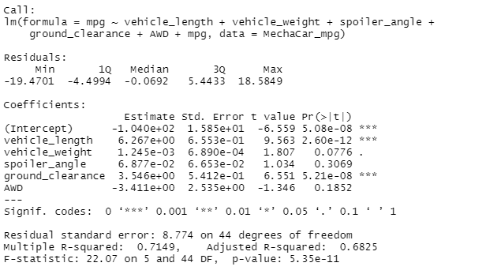
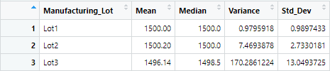
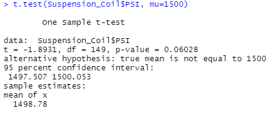
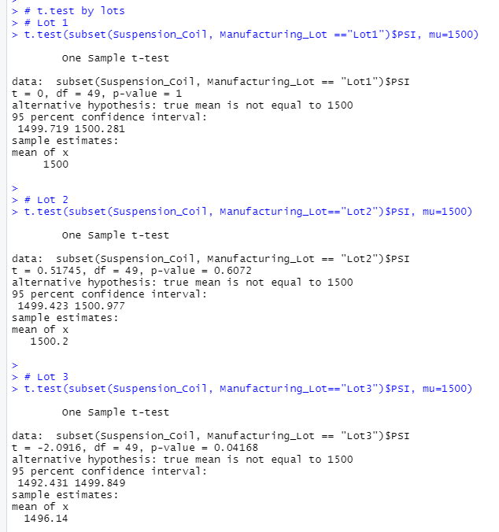

# MechaCar_Statistical_Analysis
# Background 
A few weeks after starting his new role, Jeremy is approached by upper management about a special project. AutosRUs’ newest prototype, the MechaCar, is suffering from production troubles that are blocking the manufacturing team’s progress. AutosRUs’ upper management has called on Jeremy and the data analytics team to review the production data for insights that may help the manufacturing team.  In this challenge, you’ll help Jeremy and the data analytics team do the following: 

* Perform multiple linear regression analysis to identify which variables in the dataset predict the mpg of MechaCar prototypes 
* Collect summary statistics on the pounds per square inch (PSI) of the suspension coils from the manufacturing lots 
* Run t-tests to determine if the manufacturing lots are statistically different from the mean population 
* Design a statistical study to compare vehicle performance of the MechaCar vehicles against vehicles from other manufacturers. 

For each statistical analysis, you’ll write a summary interpretation of the findings.

## Deliverable 1: Linear Regression to Predict MPG
- Methodology: Each Pr(>|t|) value represents the probability that each coefficient contributes a random amount of variance to the linear model. 

- Q1) Which variables/coefficients provided a non-random amount of variance to the mpg values in the dataset?
    - Using MechaCar_mpg dataset, vehicle_length, ground_clearance, and intercept are unlikely to have random amounts of variance to the linear model and have a significant efect on mpg. 
- Q2) Is the slope of the linear model considered to be zero? Why or why not?
    - The intercept is statistically significant (less than 0.5 and not zero). Therefore, this intercept variable has a significant amount of variablity when all the independent variables are zero. Features such as vehicle_length and ground_clearance could use some adjusting to imporove the model. 

- Q3) Does this linear model predict mpg of MechaCar prototypes effectively? Why or why not?
    - The Multiple R-squared value is 0.71, while the p-value remained significant. Indicating that the model does a decant job of predicting mpg.

## Deliverable 2: Summary Statistics on Suspension Coils

- Q1) The design specifications for the MechaCar suspension coils dictate that the variance of the suspension coils must not exceed 100 pounds per square inch. Does the current manufacturing data meet this design specification for all manufacturing lots in total and each lot individually? Why or why not?
    - By lots, lots 1 & 2 are within specifications, however lot 3 exceeds the specifications 

## Deliverable 3: T-Test on Suspension Coils

## Deliverable 4: Design a Study Comparing the MechaCar to the Competition